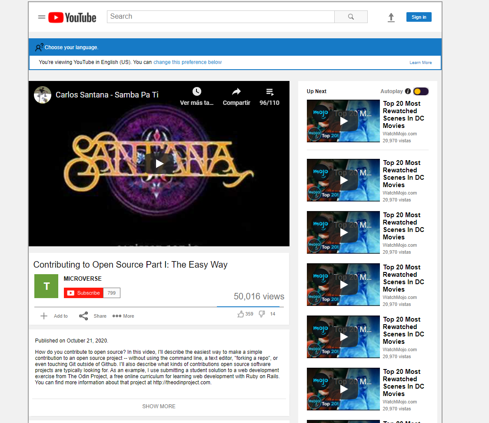

# Project Name

YouTube Page Clone

Additional description about the project and its features.

## Built With

- HTML5
- CSS

## Live Demo

[Live Demo Link](https://wusinho.github.io/YoutubePage-Clone/)

## Authors

👤 **Mar y Sol Bautista**

- GitHub: [@marilirulita](https://github.com/marilirulita)

👤 **Heber Lazo**

- GitHub: [@Wusinho](https://github.com/Wusinho)

## 🤝 Contributing

Contributions, issues, and feature requests are welcome!

Feel free to check the [issues page](issues/).

## Show your support

Give a ⭐️ if you like this project!

## 📝 License

This project is [MIT](LICENSE) licensed.
